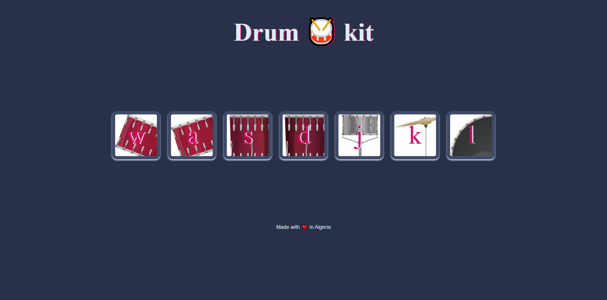

# 🥁 Drum Kit

An interactive virtual drum kit built with HTML, CSS, and JavaScript.

## 🚀 Features

- Play drum sounds by pressing the corresponding keys on your keyboard.
- Visual feedback on key press with animation.
- Simple and clean UI with instrument images.

## 🔧 Technologies Used

- HTML
- CSS
- JavaScript (DOM manipulation & event handling)

## 📸 Preview

## 🎮 How to Play

Press the following keys on your keyboard to play the drums:

| Key | Instrument |
|-----|------------|
| W   | Tom 1      |
| A   | Tom 2      |
| S   | Tom 3      |
| D   | Tom 4      |
| J   | Snare      |
| K   | Crash      |
| L   | Kick       |

## 🧠 What I Learned

- Handling keyboard events using JavaScript.
- Working with the `addEventListener` method.
- Adding sound and visual effects to web applications.
- Improving UI with animations and styling.

## 💡 Future Improvements

- Add mobile touch support.
- Add volume control or mute button.
- Add recording feature.

## 🧑‍💻 Author

Meriem Ghersi

---

Made with ❤️ in Algeria.
## click to play ----> ( https://ghersi-meriem.github.io/drum-kit/)
